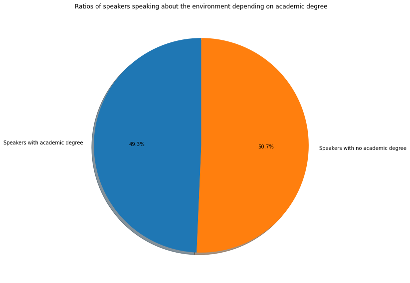

## Who said what, where, when and about what?

You can use the [editor on GitHub](https://github.com/stefnans/ada-2021-project-data-story/edit/gh-pages/index.md) to maintain and preview the content for your website in Markdown files.


### Organization
1. Identifying the most common profile to talk about a topic
2. A time analysis of the topics (Questions 3 and 4)
3. Environment topic wrt to other topics (Question 5)
4. Representation of topics in different newspapers (Question 6)

### Would you talk about the environment?


### Santiago

### Nearchos

### Ansgar

### Example graph
How likely are you to speak about the environment if you have an academic degree? You're not, here's why:



### Markdown

Markdown is a lightweight and easy-to-use syntax for styling your writing. It includes conventions for

```markdown
Syntax highlighted code block

# Header 1
## Header 2
### Header 3

- Bulleted
- List

1. Numbered
2. List

**Bold** and _Italic_ and `Code` text

[Link](url) and 
```

For more details see [Basic writing and formatting syntax](https://docs.github.com/en/github/writing-on-github/getting-started-with-writing-and-formatting-on-github/basic-writing-and-formatting-syntax).

### Jekyll Themes

Your Pages site will use the layout and styles from the Jekyll theme you have selected in your [repository settings](https://github.com/stefnans/ada-2021-project-data-story/settings/pages). The name of this theme is saved in the Jekyll `_config.yml` configuration file.

### Support or Contact

Having trouble with Pages? Check out our [documentation](https://docs.github.com/categories/github-pages-basics/) or [contact support](https://support.github.com/contact) and we’ll help you sort it out.
