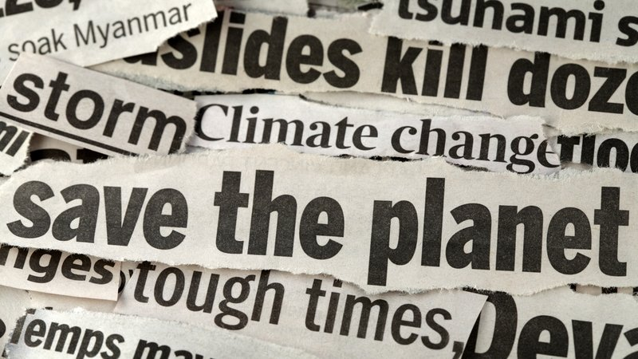
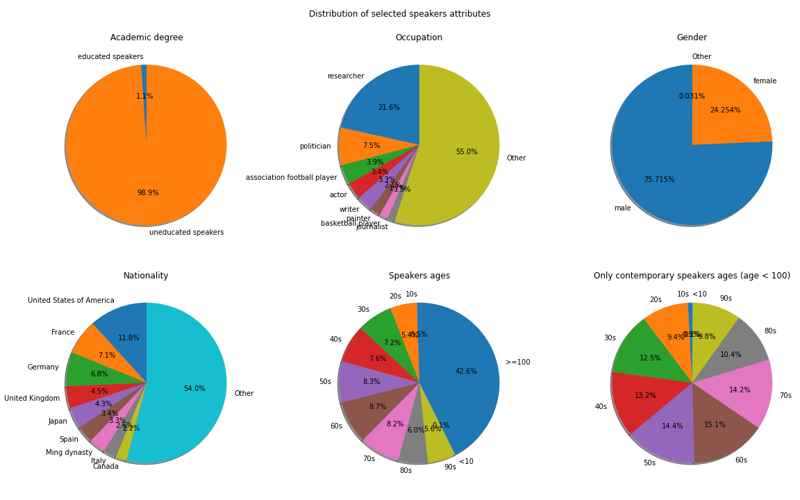
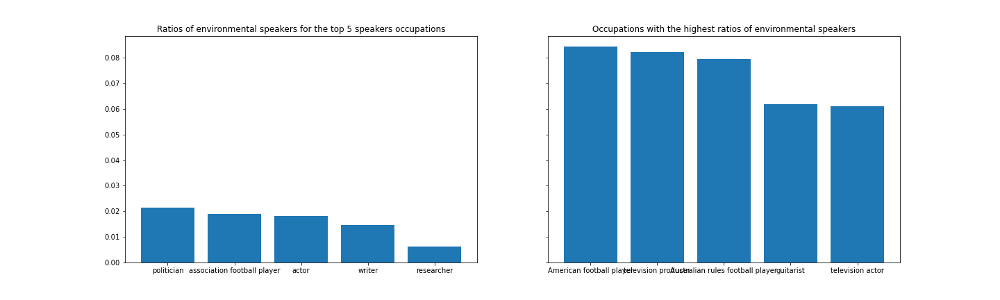
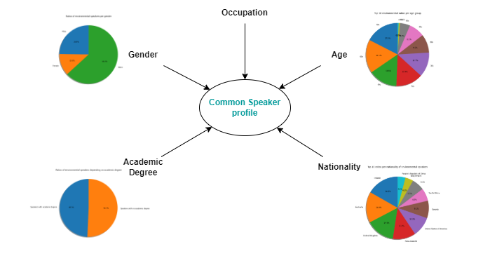
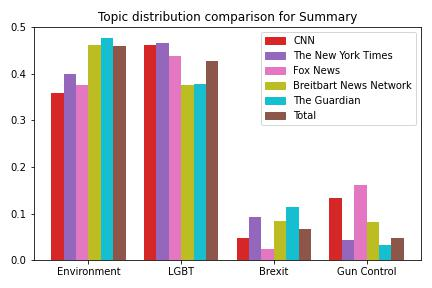
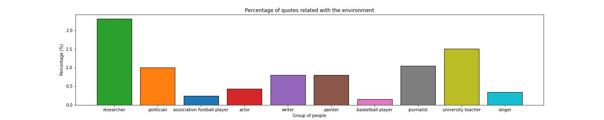
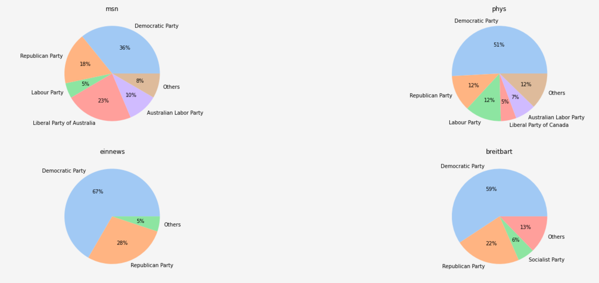
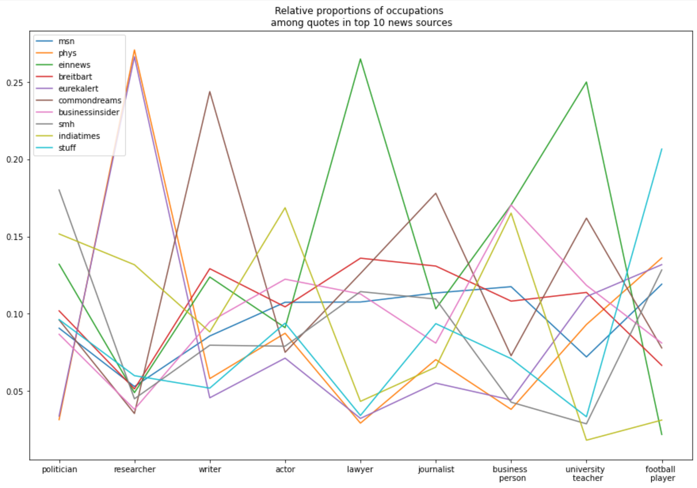

# How green is the media?

<p align="center" style="padding:10px;" >
  
</p>

Earth is experiencing a climate emergency as the climate is currently changing more rapidly than ever. In the scientific world, this has already been established but what about everyone else? The responsibility to communicate the causes, the consequences but also the means to limit global warming to normal people lies with the media. Our goal is to understand how the media has responded to this crisis by investigating the role of media sources when reporting speakers' opinion by analyzing their quotes. We will examine the quantity of quotes reported over time and their proportion compared to other topics to obtain an estimate of the relevance of the topic at hand. Moreover, we identify key characteristics of speakers in a given media source and compare these characteristics between different news sources. Opinions are shaped daily by the media and therefore we believe holding them accountable when it comes to urgent matters like this is essential.

For this study, we're conducting our analysis on the Quotebank dataset from the period of 2018-2020. Quotebank is a dataset of quotations from different newspapers and media sources, attributed to their speakers. This provides us with a rich dataset of quotations with different topics, from which we can filter the ones that talk about the environment, and upon which we can base our data story upon.


## Organization
1. Analysis of the most common profiles of the speakers who talk about the environment.
2. A time analysis of the topics 
3. Climate change representation in comparison with other topics.
4. Representation of topics in different newspapers 

## 1.  Would you talk about the environment?
The subject of the environment is brought to light by the people who talk about it. So if we're asking the question of whether the environment is well represented in the media, it stands to reason to know by whom is it usually represented.

In that sense, it's interesting to see who are the people that talk about the environment in the media and what are the characteristics that bring them together. In other words, what is **the common profile for the people that talk about the environment?**.


<p align="center" style="padding:20px;" >
  
</p>
 

 Note that this analysis was done **purely from the speaker's point of view**, we don't take into account in which newspaper or at what time period did the speaker utter this quotation. For this, we filtered the quotations that talk about the environment, and we retrieved their corresponding speakers along with their characteristics (or **features**). The initial method was easy enough, just count the features that appear most frequently within the environmental speakers. But that is not a sound idea, since the distribution of the features of the environmental speakers may be polluted by the underlying distribution of these features among all speakers.

 

For instance, only 1% of the speakers are recorded having an academic degree. So if we count the ones who have spoken about the environment, we are bound to find that most them are uneducated because of the underlying overall distribution of the speakers having an academic degree or not. This can make us draw bad conclusions from this.

We need to come up with a better metric, that measures approximately the **likelihood of speaker talking about the environment based on a certain feature**. For this we can use the **ratio of environmental speakers per feature**. That is for a certain feature f we calculate:

*# environmental speakers with feature f / total # of speakers with feature f*

and we can translate this into the likelihood of speaker speaking about the environment, given he has feature f. 

We can now use this metric to compare the environmental ratios for the top occupations of the speakers, to the occupations with the highest said ratios:



This tells us that you are more likely to talk about the environment if you were an American Football Player or a television actor than if you were a politician or a researcher!

<p align="center" style="padding:20px;" >
  
</p>

Now if we combine the top ratios from each feature separately, we get the following approximate environment speaker profile:
- They're likely working in **Arts & Entertainment**
- They're likely from the **LGBTQ community** (doesn't identify as *male* or *female*)
- They're likely from the **western hemisphere (culturally and politically speaking)**
- They're **older than 40 years old**
- They are **equally likely** to talk about the environment whether they **have an academic degree or not**.

 Note that up until now, we **isolated each feature** and then we did analysis on it separately from the other features. But one must remember that a speaker's profile is made up of several features, and sometimes the distribution of one feature may affect the distribution of another. And hence analysis should be made on the profile as a combined set of features, and not as a combination of analysis of each separate feature. 

## Santiago

## 3. Are we being fair ? A year in review. 

Is the environment equally represented in relation with other crucial topics? To answer this equation first we had to decide : Which other topics should we use in order to draw a meaningful comparison ? The topics we concluded to were LGBT Rights, Brexit and Gun Control. What lead us to this decision is our belief that during the time that our dataset is covering these topics were similarly occupying the common people and the press. Additionaly, they are all polarizing issues with multiple ethical standpoints but also potential devastating effects on the community. So, to answer this question we studied how these topics were represented during 2020.

To begin with, we noticed that in general the percentage of quotations related to the environment was less than 0.8% followed closely by LGBT rights while the other 2 topics were even lower. Moving on, we made an analysis as to how these topics are represented in newspapers. For this task we chose newspapers whose followers were considered to be either in liberal or conservative ideological group. Our conclusion was that the more conservative the readers of a certain newspaper were, the more the distribution of the quotes among those four topics was leaning towards the environment.

<p align="center" style="padding:20px;" >
  
</p>

 Next, we investigated this magnitude of environmental quotes but from a speaker's point of view. Our inquiry was the following : Given a group of people formed by a common attribute, in relation to the total amount of quotes made the same group of people, what percentage of these quotes was related to the environment ? Based on occupation our results the group of people with the highest numbers were the researchers, followed by the independent politicians and then the Germans.

<p align="center" style="padding:20px;" >
  
</p>

Now coming back to our initial question, is the climate change sufficiently represented in the media? If only 1% of the quotations coming from politicians are about it do you think that that's enough to save the world? We believe that this question, is a question that every person should answer for himself.

## 4. Does it matter what you read or watch?
<p align="center" style="padding:20px;" >
  
</p>

We found that in particular people have been quoted with high shares by almost all news that belong to the Democratic Party and the Republican Party. What was striking was the rather high share of Democratic speakers that have been quoted by the right-winged news source *breitbart* (something unusual perhaps). 

<p align="center" style="padding:20px;" >
  
</p>

Also their occupations differed quite a lot. Politicians, for example, were almost equally present in all news sources, higher for *einnews* and *smh*. Science-based news sources such as *eurekalert* and *phys* quoted researchers much more often than any other professions, something we would expect. Finally, we digged deeper for two rather opposing news sources: *breitbart*, a right-winged news magazine from the US (https://de.wikipedia.org/wiki/Breitbart_News_Network) vs *eurekalert* and tried to find out what features determine the likelihood with which someone is quoted about the environment by *breitbart*. We found that being in the Democratic Party dramatically increases (by a factor 2) ones chances while also the age plays an important role, although not as strong as expected.


### Markdown

Markdown is a lightweight and easy-to-use syntax for styling your writing. It includes conventions for

```markdown
Syntax highlighted code block

# Header 1
## Header 2
### Header 3

- Bulleted
- List

1. Numbered
2. List

**Bold** and _Italic_ and `Code` text

[Link](url) and 
```

## Conclusion
In this study, we've tried to answer the question about whether the environment has a good representation in the media. It's a hard question to answer so we approached it from different angles: 
- It was interesting to see who's likely to speak about the environment 
- 
-
- 

We've seen that the environment is not equally represented across the media. 
TODO: ouverture

For more details see [Basic writing and formatting syntax](https://docs.github.com/en/github/writing-on-github/getting-started-with-writing-and-formatting-on-github/basic-writing-and-formatting-syntax).

### Jekyll Themes

Your Pages site will use the layout and styles from the Jekyll theme you have selected in your [repository settings](https://github.com/stefnans/ada-2021-project-data-story/settings/pages). The name of this theme is saved in the Jekyll `_config.yml` configuration file.

### Support or Contact

Having trouble with Pages? Check out our [documentation](https://docs.github.com/categories/github-pages-basics/) or [contact support](https://support.github.com/contact) and we’ll help you sort it out.


You can use the [editor on GitHub](https://github.com/stefnans/ada-2021-project-data-story/edit/gh-pages/index.md) to maintain and preview the content for your website in Markdown files.
